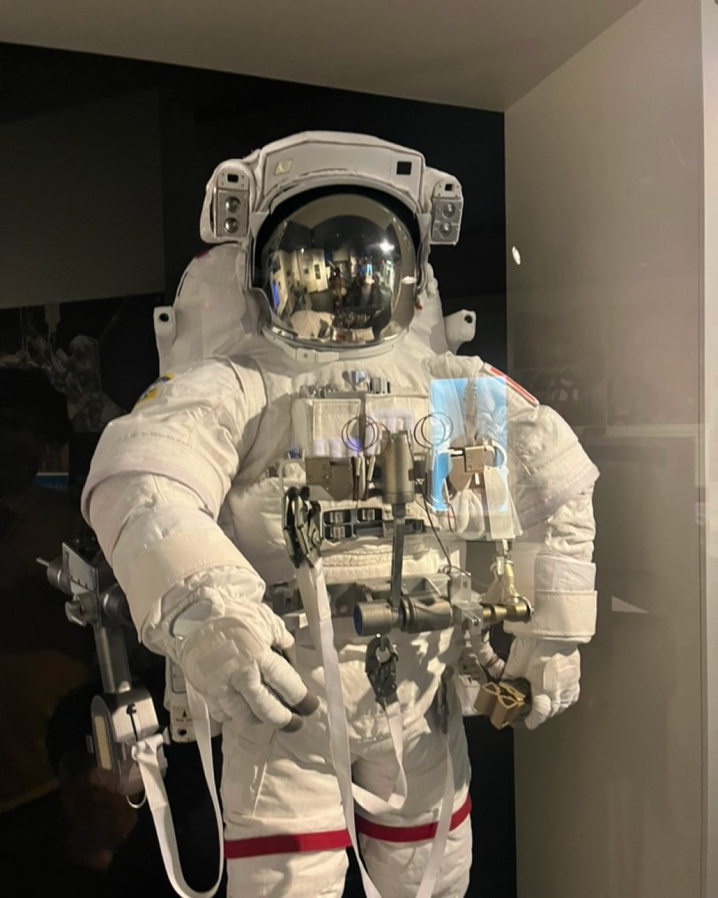
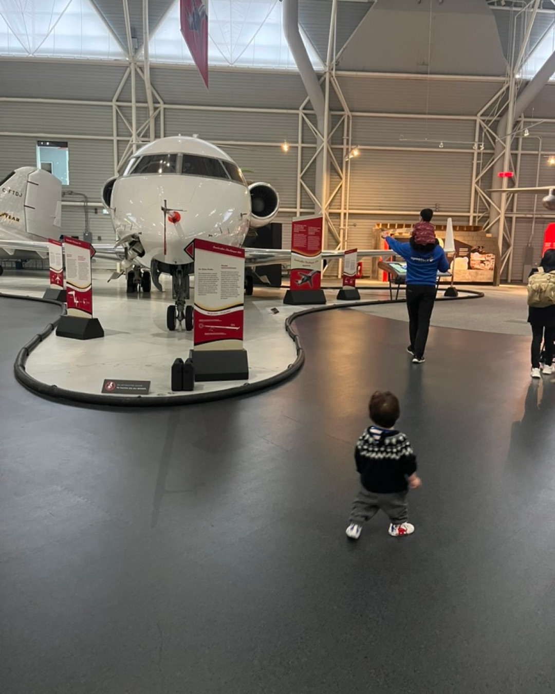
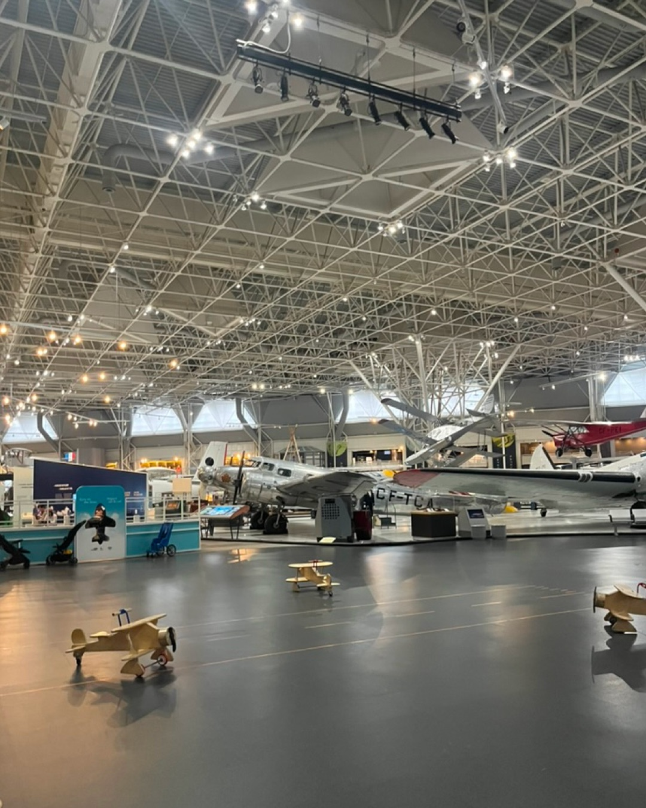

Ahora que esta de moda el Artemis II y aprovachando que tenemos un hijo que “sabe todo sobre el espacio”, fuimos al Canada Aviation and Space Museum.

Hasta ahora, el espacio es algo que Nico ha visto desde la TV o en libros. Hace un año fuimos al museo de la Aviación pero a Nico no le interesaba nada. 

Con pretexto de la vuelta a la Luna del Artemis II decidimos volver para aprender más. Y para que Nico pudiera verlo de forma más tangible, más real. 

No solo como algo que pasa “allá lejos”, sino algo que también se vive aquí en Canadá: hay astronautas, hay historia, hay tecnología.

El museo combina aviación y exploración espacial en un mismo lugar:

- Aviones históricos
- Cohetes y exhibiciones espaciales
- El Canadarm 2 (LA contribución de Canadá a la NASA)
- Trajes de astronautas
- Información sobre cómo viven en el espacio (comida, baño, etc)

**Algo importante**: hay partes interactivas donde se puede tocar, pero no los aviones.

## La experiencia con niños

Fuimos con los 2: Nico y Pato

Pensábamos que Pato se iba a aburrir… pero todo le lalmaba la atención. Estaba señalando todo. 

A Nicolás lo que más le gustó fue:

- Los trajes de astronautas
- Entender cómo viven en una nave espacial

En general, es un muy buen plan para niños, aunque hay momentos donde se puede volver un poco difícil porque quieren tocar todo !

## Cuánto tiempo se necesita?

Depende mucho de con quién vayas:

- Con adultos: varias horas (si quieres leer todo y entender la evolución de la aviación)
- Con niños: La hora ghratuira de 4-5pm estuvo bien. 

### Tip clave: entrada gratis

De 4:00 a 5:00 pm la entrada es gratuita (requiere registro previo).
Esto lo hace perfecto para una visita más ligera con niños.

👉 Más info y registro: https://ingeniumcanada.org/aviation/visit

## Vale la pena?

Sí. Incluso pagando, vale la pena.
Pero si vas con niños, aprovechar la hora gratis es una muy buena estrategia.

## Qué haríamos diferente

Guardaríamos tiempo para la tienda.
Tiene muchas cosas interesantes, especialmente si tienes niños a los que les gusta el espacio.

## Conclusión

Es un plan muy recomendable si:

- Tienes niños curiosos
- Te interesa el espacio
- Quieres hacer algo diferente en Ottawa

Y especialmente en momentos como ahora, con misiones como Artemis II, hace que todo se sienta mucho más cercano y real.
