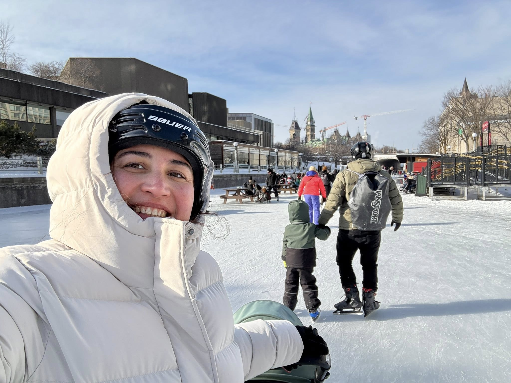
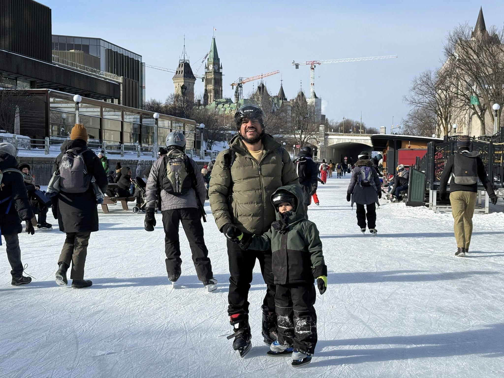

El año pasado el canal abrió muy pocos dias. Pato acababa de nacer y Sonia no estaba en las mejores condiciones para patinar. 

Así que esta vez, tan pronto abrieron el canal fuimos a patinar. 

No sé exactamente como funciona pero según yo entre más frio haga más lisa esta la pista. Y si no ha nevado en un rato entonces todavia mejor. 

El chiste es que la pista estaba buenisima. Hicimos como 2 horas patinando.

La idea es estacionarse en el City Hall. Los fines de semana el estacionamiento es baratísimo y eso esta buen porque las otras opciones son estacionarse en la calle y es imposible saber cuando hay multas y por que en Ottawa. 

Ahí está el Rink of Dreams pero esta vez lo ignoramos. 

Caminas un poquito y llegas al canal. Ese es el kilometro 0 de ahi son 8 kilometros de diversion y frio. 
