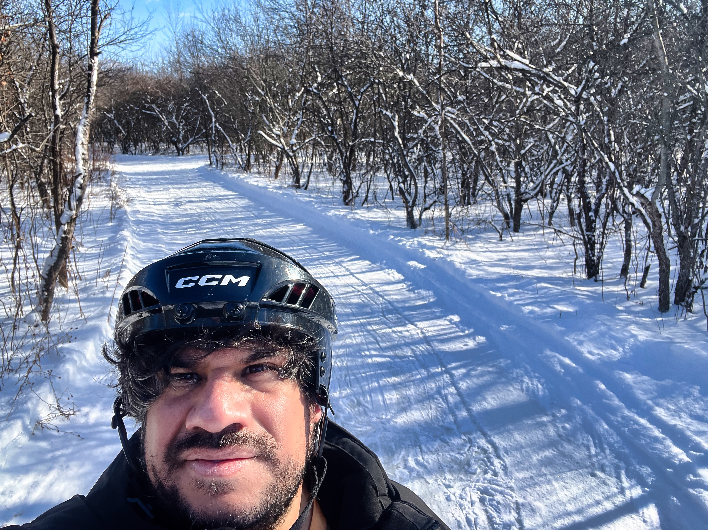

El sábado pasado fuimos a patinar a [River Oak](https://www.riveroak.ca/). Es un "skating trail" en el bosque. Básicamente, es como ir a hacer hiking pero en vez de caminar estás patinando. 

Nosotros compramos el season pass ($50 CAD) y creo que ya se pagó con una visita, aunque esperamos hacerlo una rutina de fin de semana.

Desde Nepean, queda a 30 minutos, así que no es algo terriblemente lejos pero esta lo suficientemente lejor para no sentir que sigues en la ciudad.

LLevamos chocolate caliente y nuestras aguas en la hielera pero River oak tiene una pequeña cafeteria. Creo que nos lo pudimos ahorrar.

También, nosotros ya tenemos patines de [Decathlon](https://www.decathlon.ca/en/p/8544548/ice-skatesfit-500-black#/?queryID=8b477322a9370952ff277e7ac7eb15f3) pero ahi mismo puedes rentar. Incluso hay renta de snowshoes para caminar si no quieres patinar.

No hay limite de tiempo, lo cual esta buenisimo porque pudimos tomar un descanso de 30 minutos para seguir patinando - hasta que nos dio hambre. 

Eso sí, la pequeña cafetería solo tiene hotdogs. 

