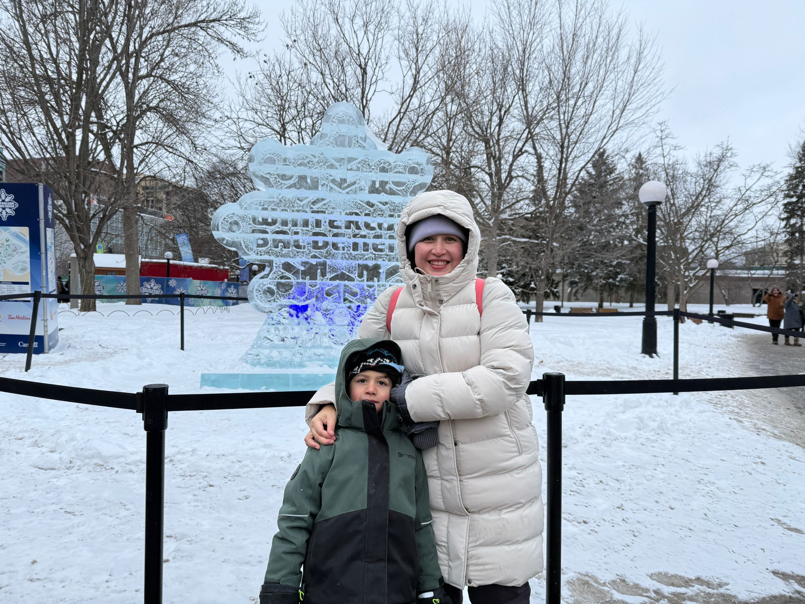
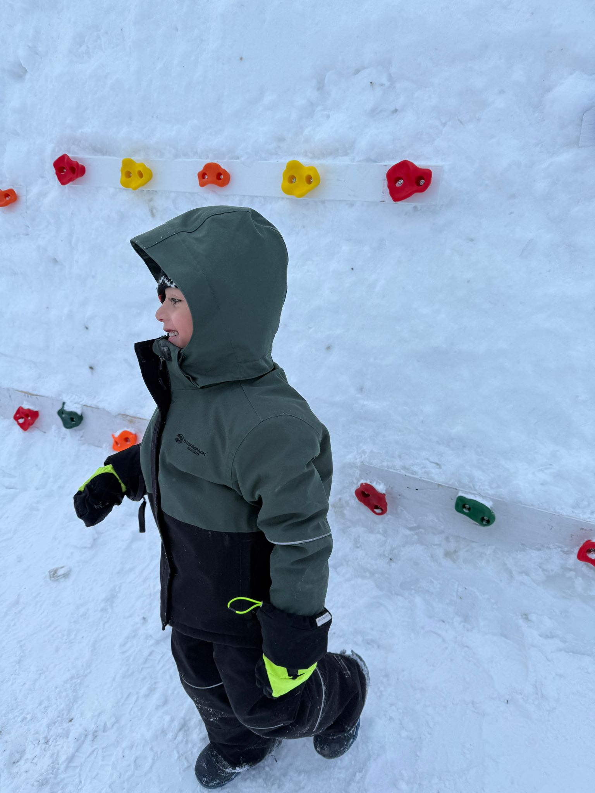
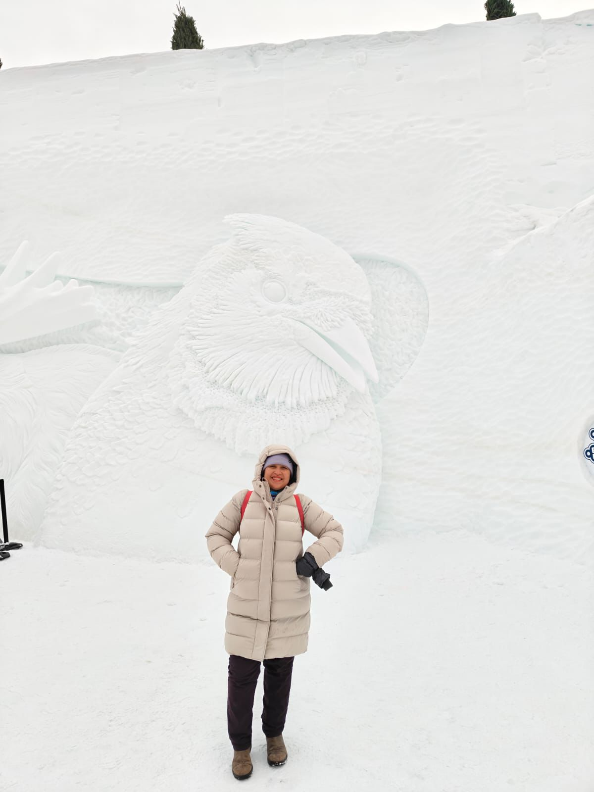

Esta semana vino Compitas de visita desde Kignston. Tenía que recoger su visa y aprovecho para quedarse con nosostros unos días.

Nosotros aprovechamos para enseñarle lo que Ottawa tiene en invierno. Empezamos con ir a patinar al canal

Nos estacionamos otra vez en City Hall y que es barato. Camino al canal vimos que habia camiones que te llevaban gratis al Winterlude.

El plan original era ir al canal el sábado y el domingo ir al Winterlude, pero viendo el camion y checando que ya no había cupo en el centro, decídimos ir.

Fuimos al parque Jacques-Cartier después de ver lo que había en Confederation park. Esta vez estuvo muy padre porque no había tanta gente.

